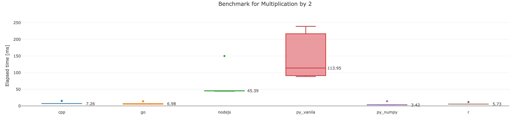
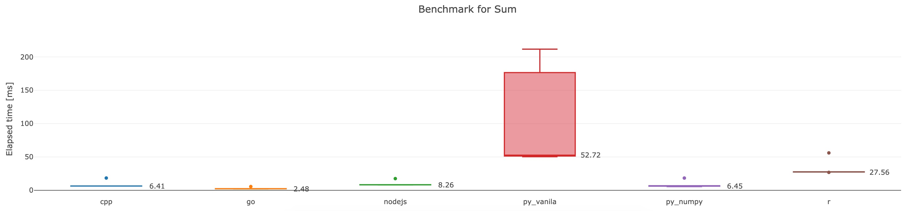
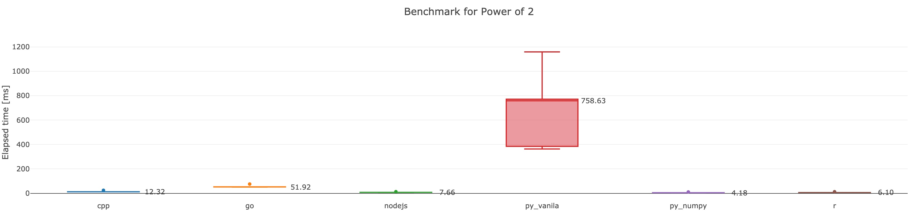
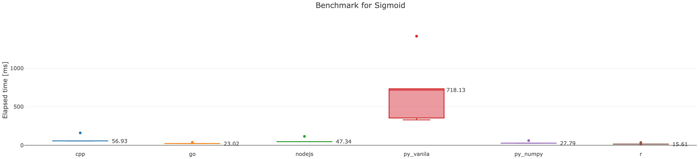
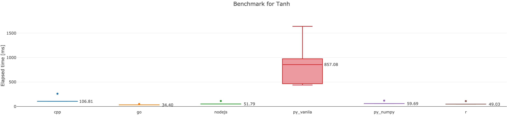

# Math operations benchmark

## Tested languages

```yaml
- cpp:
  - g++: 8.3.0-r0
- golang: 1.11
- python: 3.7.4
  - numpy: 1.17.2
- R: 3.6.1
```

## Benchmark procedure

Run a cycle/program 100 repetitions and measure elapsed time of every math operation

### Cycle

1. Generate an array of <em>1M</em> elements, each element <em>is a random int between 0 and 100</em>
2. Multiply generated array elements by 2
3. Add to the <em>i-th</em> element of array it's <em>(i+1)-th</em> value, last element of array to be summed up with the 0-th element
4. Get generated array elemnts to the power of 2
5. Calculate <em>sigmoid</em> function for all elements of array
6. Calculate <em>tanh</em> function for all elements of array

### Hardware/Enviroment

Tests were performed on a GCP <em>g1-small</em> machine, configs:

```yaml
instance:
  - type: g1-small
  - os-image: cos-cloud/cos-stable-77-12371-76-0
  - cpu: Intel(R) Xeon(R) CPU @ 2.00GHz
  - ram: 1.7G
```

# Results

Timing meadian values in ms
| |cpp|go|nodejs|py_vanila|py_numpy|r|
|:---|---:|---:|---:|---:|---:|---:|
|Multiplication by 2|7.26|6.98|45.39|113.95|3.42|5.73|
|Sum|6.41|2.48|8.26|52.72|6.45|27.56|
|Power of 2|12.32|51.92|7.66|758.63|4.18|6.1|
|Sigmoid|56.93|23.02|47.34|718.13|27.79|15.61|
|Tanh|106.81|34.4|51.79|857.08|59.69|49.03|

## Multiplication by 2



## Sum



## Power of 2



## Sigmoid



## Tanh



# Contribution

Feel free to add more benchmark tests and open a pull request